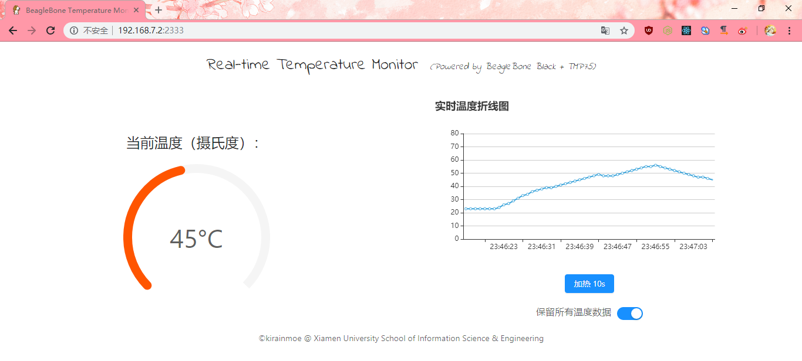

# BeagleBone Black Temperature Monitor

Real-time temperature monitor powered by Beaglebone Black + TMP75, providing interactive front-end.

# Tech Stack

 - Node.js (Recommend to use latest version)
 - React (for front-end)
 - express (for back-end)
 - honoka (fetch() polyfill)
 - ant design
 - echarts

# Theory

TMP75 uses i2c protocol to send temperature data. In BeagleBone's Debian system, we can run `i2cdetect -y -r 1` to obtain the address of TMP75; and when we run `i2cget -y -f 1 0xyy` (`yy` is the address you get from `i2cdetect`), it will returns a hex which is the temperature. We can integrate these operations into a web-server so that we can get data / send requests from browser front-end.

# Usage

You should have your TMP75 connected correctly to your BeagleBone Black. For example:
  - TMP75 V33 to BBB DC3.3V (P9_03)
  - TMP75 GND to BBB GND (P9_01)
  - TMP75 SCL to BBB SCL(P9_19, do not connect to 17 which is not occupied:) )
  - TMP75 SDA to BBB SDA(P9_20, do not connect to 18 which is not occupied:) )
  - TMP75 I/O to BBB GPIO(whichever has not been occupied is OK)
  
Then clone this repository to your BeagleBone Black and install dependencies:
```bash
$ git clone https://github.com/kirainmoe/beaglebone-temperature-monitor
$ cd beaglebone-tempature-monitor
$ npm install
```

Modify your config file. Note that app can detect your i2c address automatically, but you should specify the GPIO port):
```bash
nano config.js
```

Then run:
```bash
$ npm start
# or: $ node index.js
```

Open your browser (default port is 2333): `http://192.168.7.2:2333`

# Screenshot



# License

This project is my tutorial experiment in XMU. It is MIT licensed.
